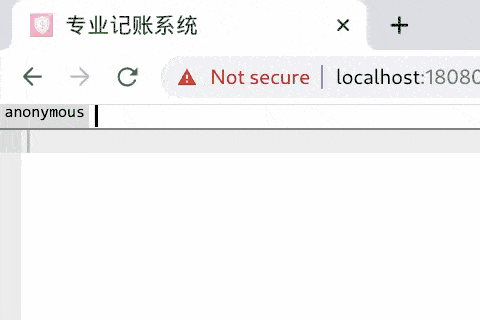
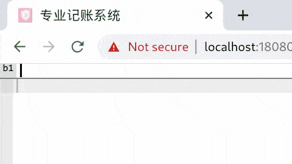
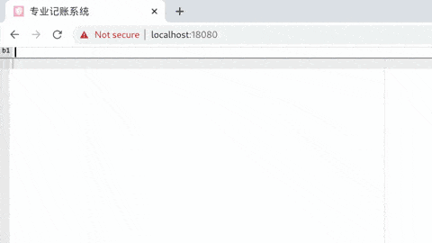

# ProfessionalAccounting

> 使用借贷记帐法的记账软件

[](https://ci.appveyor.com/project/b1f6c1c4/professionalaccounting)
[](https://ci.appveyor.com/project/b1f6c1c4/professionalaccounting/build/tests)
[](https://coveralls.io/github/b1f6c1c4/ProfessionalAccounting)

## 简介

- 基于[借贷记账法](https://en.wikipedia.org/wiki/Double-entry_bookkeeping)
- C/S架构
- 使用DSL（Domain Specfic Langauge）来增删改查
- 后端
    - 单体架构，业务逻辑使用`C# 10.0`编写
    - 数据库采用MongoDB
    - 使用`.NET 8.0`平台编译
    - 使用nginx反向代理，支持TLSv1.3、HTTP/3
    - 使用docker部署
- 前端
    - 使用Redux状态管理
    - 使用p5.js绘制UI
    - 使用webpack打包

## 安装与配置

本项目提供两种部署方式：
1. 本地/内网调试（无TLS，无客户端认证，无可靠数据存储）
1. 网络部署（TLS，客户端证书，MongoDB Atlas数据库后端）

### 准备

首先准备一台Linux服务器，安装以下软件：
- docker，推荐采用[get.docker.com](https://get.docker.com/)
- （仅限网络部署）openssl（请自行检索安装方法）

### 配置记账系统功能

为了方便地从GitHub下载单独文件（而不用下载整个repo的整个历史），
此处推荐大家使用[git-get](https://github.com/b1f6c1c4/git-get)来下载。

1. ssh登录*服务器*
1. 下载`docker-compose.yml`文件（网络部署）或者`docker-compose.local.yml`（本地部署）：
    ```bash
    git get b1f6c1c4/ProfessionalAccounting -- docker-compose.yml
    git get b1f6c1c4/ProfessionalAccounting -- docker-compose.local.yml
    ```
1. 下载示例配置文件夹，放在`/data/accounting/config.d/`（网络部署）：
    ```bash
    mkdir -p /data/accounting
    git get -o /data/accounting/config.d b1f6c1c4/ProfessionalAccounting -- example/config.d/
    ```
1. 修改必须修改的配置文件：
    - `BaseCurrency.xml` - 记账本位币
    - `Symbol.xml` - 货币符号表
    - `Titles.xml` - 记账科目列表
    - `Carry.xml` - 期末结转规则
    - `Exchange.xml` - 汇率查询API（[fixer.io](https://fixer.io)、[CoinMarketCap](https://coinmartketcap.com)）的配置
1. 修改可选的配置文件：
    - `Abbr.xml` - 登记新记账凭证时使用的缩写列表
    - `Cash.xml` - 现金流插件相关配置
    - `Composite.xml` - 常用检索式列表
    - `Util.xml` - 快速登记记账凭证插件的配置
    - `SpreadSheet.xml` - 表格形式对账插件的配置

### 配置服务器和客户端x509证书（仅限网络部署）

1. 将服务器证书和私钥（`server.crt`，`server.key`）放在服务器的`/data/accounting/certs`目录下
    1. 如果你没有服务器证书，推荐使用 [acme.sh](https://github.com/acmesh-official/acme.sh/wiki/%E8%AF%B4%E6%98%8E) 来免费获得一个
1. 在服务器上创建dhparams：
    ```bash
    openssl dhparam -out /data/accounting/certs/dhparam.pem 2048
    ```
1. 创建自签名的客户端证书和私钥：
   （注意：如果客户端机器未安装`openssl`，则在服务器上创建客户端的证书和私钥，并把加密后的私钥`client.p12`传回客户端）
    1. **在客户端机器上**创建证书和私钥：
    ```bash
    openssl req -x509 -newkey rsa:2048 -keyout key.pem -out cert.crt -days 1825 -nodes
    chmod 0400 key.pem
    ```
    1. 将证书上传服务器：
    ```bash
    scp ./cert.crt <server>:/data/accounting/certs/client.crt
    ```
    1. 将证书和私钥封装成`.p12`格式，删除原来的`.pem`文件：
    （这一步的目的是方便在客户端上安装证书）
    ```bash
    openssl pkcs12 -export -inkey key.pem -in cert.crt -out client.p12 && rm -f key.pem
    ```
1. 在客户端上安装证书：
    1. 恕不赘述，请自行Google `install p12 certificate on XXX`（`XXX`=Linux/FreeBSD/Windows/MacOS/iOS/iPadOS/...）

### 启动、停止

直接使用docker-compose启动，将在18080端口侦听请求：

- 本地部署：
    ```bash
    docker compose -f docker-compose.local.yml up -d   # start
    docker compose down     # stop
    ```
- 网络部署：
    ```bash
    docker compose up -d    # start
    docker compose down     # stop
    ```

## 基本使用方法

### 记账（记账凭证的增加、修改与删除）



1. 在客户端上使用浏览器访问服务器的18080端口：`http://<server>:18080/`（本地）或`https://<server>:18080/`（网络）
1. 可以看到用户界面分为两部分：上面的一行命令框和下面的编辑器
1. 在命令框中，输入命令：`login <username>`并按回车
    - `<username>`是你在记账系统中的用户名
    - 无需注册，没有密码，用户名只是个代号而已
    - 用户名会在前端存储在localstorage中，无需每次`login`
1. 按tab可以在命令框和编辑器之间切换
1. 执行空白命令会在编辑器中添加一个空的记账凭证模板（`@new Voucher { }@`）
1. 在模板中需要填写记账凭证的内容，也就是**谁**、**用什么货币**、**关于什么**、交易了**多少钱**
    - 例子：`T1001 -5`
        - 字面意思是：我（刚刚`login`的用户名）、用本位币（参考`BaseCurrency.xml`）、关于库存现金（参考`Titles.xml`）、交易了-5元
        - 翻译过来就是：现金少了5元人民币（假设你没有修改`BaseCurrency.xml`）
    - 例子：`sp 5`
        - 字面意思是：我、用本位币、关于食品（参考`Abbr.xml`）、交易了5元
        - 翻译过来就是：食品开销增加了5元人民币
    - 两个例子合在一起，就表明了“今天我用5元人民币现金购买了5元的食品”
1. 按Alt+Enter保存记账凭证，可以看到增加了不少信息：
    - `^5edc...^` 这是mongoDB的`_id`，用于唯一标识记账凭证
    - `20200606` 这是交易发生的日期，在保存记账凭证的时刻被记录下来了
    - `// 库存现金` 这是注释，以免使用者忘记记账科目
    - `T1001 -5` 与保存之前的写法和语义完全相同
    - `T660206 '食品' 5` 这是从`sp 5`翻译过来的完整写法
        - 在`Abbr.xml`里面已经规定了`sp`就是`T660206 '食品'`的简称，所以在保存记账凭证时变回原样也不足为奇
1. 按Alt+Delete可以删除已经保存的记账凭证
    - 如果记账凭证尚且没有保存，那么它也就无所谓删除，一旦刷新页面就会丢掉
1. 对于已经保存了的记账凭证，再次按Alt+Enter可以修改它的内容

*注意：记账凭证不能嵌套，如果不小心在一个记账凭证模板里面又嵌套了一个模板，请立即按Ctrl+Z撤销。*

### 检索



在命令框中执行检索命令可以列出相应的记账凭证：

*注意：执行命令会覆盖下方编辑器中的全部内容；如果你希望在编辑器中添加而非覆盖，请在命令框中按Shift+Enter。*

- `.` - **我**、**今天**都发生了什么交易
- `..` - **我**、**昨天**都发生了什么交易
- `T1001 .` - **我**、**今天**都发生了什么**现金**交易
- `T660206 食品 0` - **我**、**这个月**都发生了什么**食品**交易
    - 注意这里不能使用`sp`缩写
- `unsafe 2020` - **我**、**在2020年**都发生了什么交易
    - 由于可能返回非常多的结果，这里需要加上关键词`unsafe`
- 关于记账凭证检索式（DSL）的具体语法，可以在命令框中输入`?`命令调出帮助文档

### 汇总



在命令框中执行分类汇总命令可以对帐务数据进行统计：

- `` ` `` - 我的基本财务报表
- `` 0 ` `` - 我这个月的资金变动情况
- `` ~-1 ` `` - 我上个月的基本财务报表
- 关于分类汇总检索式（DSL）的具体语法，可以在命令框中输入`?`命令调出帮助文档

### 其他功能

- [常见记账凭证的快速录入](AccountingServer.Shell/Serializer/AbbrSerializer.cs)
- [AA制消费的快速录入](AccountingServer.Shell/Serializer/DiscountSerializer.cs)
- [多币种记账](AccountingServer.Entities/Voucher.cs#L153-L157)（支持一张记账凭证多个币种共存）
- [汇率查询与自动转换](AccountingServer.BLL/Util/Exchange.cs)（在分类汇总时可按本位币显示外币）
- [多用户互相转账](AccountingServer.Entities/Voucher.cs#L147-L151)（支持一张记账凭证多个用户共存）
- [记账本位币变动](AccountingServer.Shell/Carry/BaseCurrencyShell.cs)（所有者权益币种变动）
- [固定资产管理](AccountingServer.Shell/AssetShell.cs)（购置登记、折旧、贬值与处置）
- [自动摊销](AccountingServer.Shell/AmortizationShell.cs)
- [期末结转](AccountingServer.Shell/Carry/CarryShell.cs)
- [JSON/CSV格式导入/导出](AccountingServer.Shell/Serializer)
- [（妻妻）共同财产现金流分析](AccountingServer.Shell/Plugins/Coupling)
- [支票管理](AccountingServer.Shell/Plugins/Cheque)
- [利息收入与费用计算](AccountingServer.Shell/Plugins/Interest)
- [投资收益率计算](AccountingServer.Shell/Plugins/YieldRate)
- [活期存款利息计算](AccountingServer.Shell/Plugins/BankBalance)
- [现金流预估](AccountingServer.Shell/Plugins/CashFlow)
- [信用卡外币交易入账](AccountingServer.Shell/Plugins/CreditCardConvert)
- [信用卡对账](AccountingServer.Shell/Plugins/Statement)
- [表格对账统计](AccountingServer.Shell/Plugins/SpreadSheet)

## 开发

### 项目文件结构

- `nginx` - 前端
- `AccountingServer` - HTTP Server
- `AccountingServer.Shell` - 记账凭证的序列化/反序列化，分类汇总的显示
- `AccountingServer.BLL` - 汇率转换，分类汇总，固定资产处理，摊销处理
- `AccountingServer.DAL` - mongoDB数据库访问
- `AccountingServer.Entities` - 基本对象结构定义
- `AccountingServer.QueryGeneration` - 基于Antlr4的DSL Parser
- `AccountingServer.Test` - 单元测试和集成测试

### 本地后端开发环境

#### 在Linux上构建开发环境

1. 请先安装以下工具：
    - [.NET 7.0](https://dotnet.microsoft.com/download/dotnet/7.0)
    - [JetBrains Rider](https://www.jetbrains.com/rider/)
    - [Docker](https://www.docker.com/)
1. 启动测试数据库：

    ```bash
    docker run -d --rm --name mongo -p 27017:27017 mongo
    ```

1. 启动Rider即可。

#### 在Windows上构建开发环境

1. 请先安装以下工具：
    - [.NET 7.0](https://dotnet.microsoft.com/download/dotnet/7.0)
    - [Visual Studio](https://visualstudio.microsoft.com/)
    - [Mongo DB](https://www.mongodb.com/)
1. 启动测试数据库：在`services.msc`中启动`MongoDB`服务。
1. 启动Visual Studio即可。

### 本地前端开发环境

1. 请先安装以下工具：
    - [nodejs](https://nodejs.org/)
1. 下载所需npm包：

    ```bash
    cd nginx && npm install
    ```

1. 启动webpack开发环境：

    ```bash
    npm run serve
    ```

## 许可

本项目以GNU AGPL v3.0协议开源。
This project is licensed under **GNU AGPL v3.0** only. (AGPL-3.0-only).

注解：（请参阅协议原文，以下解释没有法律效力）

- 若个人开发者采用客户端证书的方式将端口保护起来，阻止自己以外的其他任何人访问，
  这种行为不算“making available to the public”，也不构成协议中的
  “propagate/convey/remote network interaction”，
  因此将**不受GNU AGPL v3.0协议的限制**。
- 但是若个人开发者不采用任何方式保护端口，其他人将有可能通过网络与该软件交互
  （“remote network interaction”），这种行为就算作“convey”了。
  这种情况下该行为**受到GNU AGPL v3.0协议的限制**，必须提供与后端程序的**版本一致**、**完整的**源代码。

